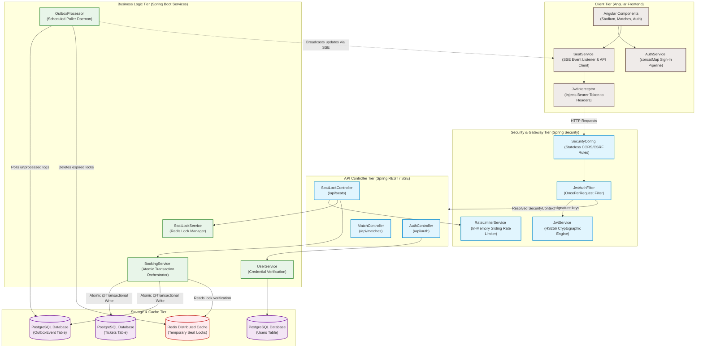

# Project Architecture & Class Guide

This reference guide provides a complete, top-to-bottom overview of the Ticket Booking System’s architecture. It details how the Angular front-end, Spring Boot backend, Redis cache, PostgreSQL database, and asynchronous outbox workers interface with each other.

---

## 🏗️ Full-System Architecture & Component Diagram

This diagram visualizes the end-to-end request flow, database dependencies, cache scopes, and real-time Server-Sent Events (SSE) pathways across the entire application:

---

## 📂 Class & File Functional Breakdown

Use this quick-reference checklist during your interview to explain the exact purpose and tech stack of every class in the project:

### 1. Frontend (Angular - TypeScript & CSS)
* **`AuthService`**:
  * **Functionality**: Manages sign-up, sign-in, and log-out workflows. Utilizes RxJS `concatMap` pipelines to guarantee sequential request resolution (e.g. Authenticate Credentials $\rightarrow$ Fetch Profile $\rightarrow$ Initialize SSE Connection).
* **`JwtInterceptor`**:
  * **Functionality**: Automatically intercepts all standard Angular `HttpClient` transactions, appending a cryptographically signed `Bearer <token>` to the `Authorization` header to authenticate requests.
* **`StadiumComponent`**:
  * **Functionality**: A interactive SVG-driven user interface displaying seating arrangements in real-time. Highlights locks, reservations, and available seating states dynamically.
* **`SeatService`**:
  * **Functionality**: Orchestrates API requests for locking and booking seats. Initiates a `EventSource` subscriber connection to receive real-time Server-Sent Events (SSE) from the backend.
* **`ToastService`**:
  * **Functionality**: Provides pop-up message notifications on the UI to warn users of concurrent conflicts (e.g., "Seat locked by another user").

### 2. Backend Gateway & Security (Spring Boot Security)
* **`SecurityConfig`**:
  * **Functionality**: Configures Spring Boot's HTTP Filter Chain. Enforces `SessionCreationPolicy.STATELESS` (for no-session JWTs), defines Whitelisted CORS domains, disables CSRF, and manages route protections.
* **`JwtAuthFilter`**:
  * **Functionality**: A servlet filter that intercepts incoming requests, extracts the JWT, verifies it via `JwtService`, and populates Spring's thread-local `SecurityContextHolder`.
* **`JwtService`**:
  * **Functionality**: Generates and parses HMAC-SHA256 JWT tokens. Extracts variables, verifies signatures against an environment key, and validates token expiration.
* **`RateLimiterService`**:
  * **Functionality**: A high-efficiency thread-safe in-memory rate limiter using a `ConcurrentHashMap` with atomic integers. Enforces a maximum of 20 lock attempts per user per minute.

### 3. Backend Controllers (Spring Boot REST / SSE)
* **`AuthController`**:
  * **Functionality**: Exposes registration, login, and token-verification (`/me`) endpoints. 
* **`SeatLockController`**:
  * **Functionality**: Manages transactional HTTP requests to temporarily lock, unlock, or book seats. Exposes the text-event-stream (`/stream`) SSE connection endpoint.
* **`MatchController`**:
  * **Functionality**: Exposes match selection configurations.

### 4. Backend Core Business Logic (Spring Boot Services)
* **`UserService`**:
  * **Functionality**: Manages password encoding using `BCrypt`, validates login credentials, and generates user tokens.
* **`BookingService`**:
  * **Functionality**: Orchestrates the atomic seat booking transaction. Performs three key steps within a `@Transactional` database boundary:
    1. Compares requesting user ID against the Redis lock owner to prevent lock hijacking.
    2. Persists the `Ticket` row in PostgreSQL.
    3. Persists a transactional event log in the `OutboxEvent` table to maintain data integrity.
* **`SeatLockService`**:
  * **Functionality**: Reserves temporary seat allocations inside Redis with a configurable TTL (Time to Live) to prevent stale locks. Publishes SSE updates to active clients.
* **`OutboxProcessor`**:
  * **Functionality**: A scheduled background polling worker. Polls the database every 1 second, processes queued `OutboxEvents`, deletes temporary locks in Redis, and broadcasts real-time SSE seat updates to all connected viewers.

### 5. Persistence Layer (Entities, Repositories, Cache)
* **`User`, `Ticket`, `OutboxEvent` (Entities)**:
  * **Functionality**: JPA entities mapping code models directly to database tables inside PostgreSQL.
* **`TicketRepository` (JPA Interface)**:
  * **Functionality**: Standard queries for fetching tickets. Enforces a DB-level composite unique constraint on `(match_name, seat_id)` to abort race conditions.
* **`OutboxEventRepository` (JPA Interface)**:
  * **Functionality**: Standard repository to read/write transactional outbox events.
* **`StringRedisTemplate`**:
  * **Functionality**: Spring Data connection client that supports high-speed atomic transactions in your Redis instance.
