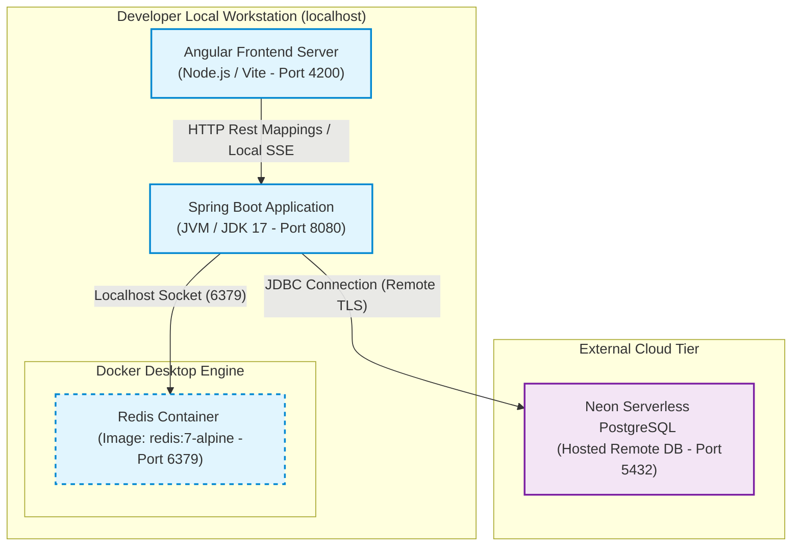
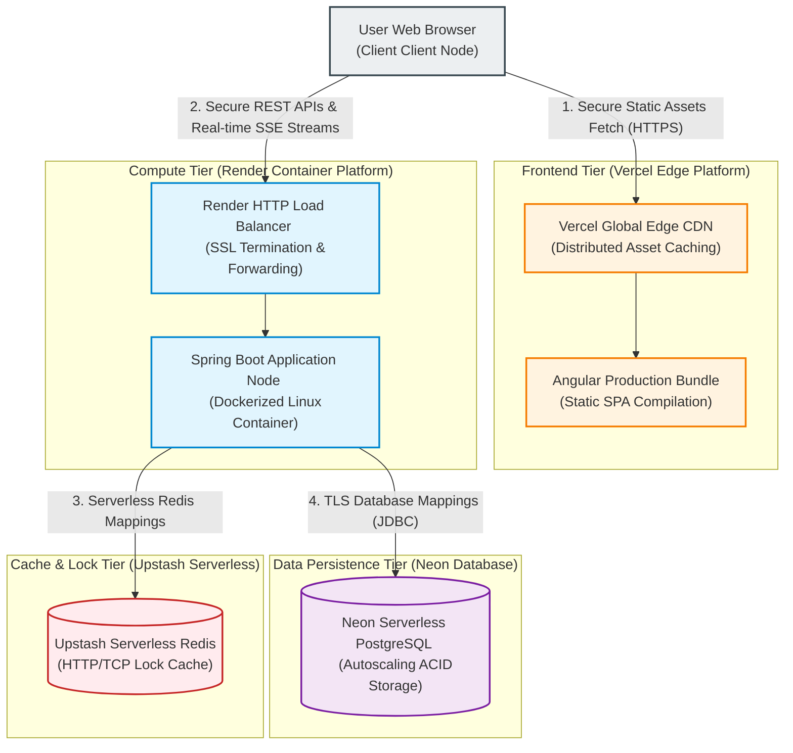
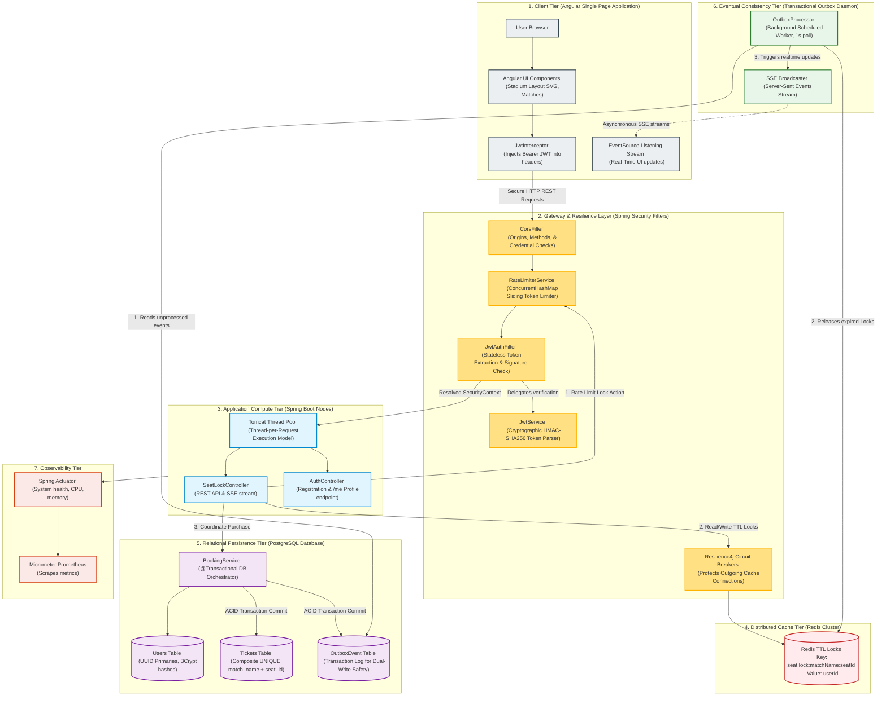

# System Design & Architecture Master Guide

This document presents a comprehensive, high-fidelity system design architecture for the Ticket Booking System. It details how the platform addresses high concurrency, data consistency, eventual consistency, rate limiting, and real-time event broadcasting at scale, along with its physical infrastructure and deployment topology.

---

## 🌐 Infrastructure & Deployment Topology

This section details the physical layout of the system across both the local development workspace and the live cloud production environment.

### 1. Local Development Topology (Docker & Local JVM)
In the local development environment, the system utilizes local execution runtime instances alongside Docker containers to isolate infrastructure services:

---

### 2. Cloud Production Deployment Topology (PaaS/SaaS Serverless Architecture)
In production, the application is deployed using a decoupled, serverless and containerized architecture across multiple dedicated cloud providers to maximize scalability and cost-efficiency:

---

## ⚡ High-Level User Journey & Periodic Operations

This chronological breakdown details exactly what happens when an authenticated user enters the website, attempts to reserve a seat, and how background tasks operate on a minute-by-minute basis.

### 1. User Entrance & Real-Time Sync (T = 0 seconds)
1. **Credentials Retrieval**: The user navigates to the application. The Angular front-end fetches the JWT from the browser's `localStorage` (`ticket_jwt`).
2. **Session Verification**: The `JwtInterceptor` intercepts an automatic call to `GET /api/auth/me`. If the server validates the token, the UI logs the user in automatically.
3. **SSE Connection Setup**: Once logged in, Angular immediately establishes a secure Server-Sent Events (SSE) stream via a browser `EventSource` connecting to `GET /api/seats/{matchName}/stream`. The client is now registered as an active viewer.
4. **Layout Render**: The client fetches the current matches list. Clicking a match loads the dynamic stadium seating layout (`StadiumComponent`), reflecting real-time locked or booked seat classes.

### 2. Selecting & Locking a Seat (Action Phase)
1. **Lock Request**: The user clicks on an available seat (e.g., "A1"). Angular dispatches a `POST /api/seats/{matchName}/A1/lock`.
2. **Rate Limit Evaluation**: The Spring Boot backend intercepts the call. `RateLimiterService` increments the user's thread-safe counter. If the user has made $\le$ 20 lock requests in the current minute, the request is approved.
3. **Acquiring Caching Lock**: `SeatLockService` requests a Redis lock using `SET seat:lock:{matchName}:A1 {userId} NX EX 600`.
   * **`NX`**: Ensures the lock is only created if the key does not already exist (guarantees mutual exclusion).
   * **`EX 600`**: Sets a strict Time to Live (TTL) of **10 minutes** (600 seconds).
4. **SSE Event Broadcast**: Once the lock is acquired, the backend publishes a seat lock event. The SSE broadcaster sends a JSON update (`seatId: A1, status: locked`) to all active stream clients, turning seat A1 yellow on everyone's screen in real-time.

### 3. What Happens Every Minute (Periodic System Execution)
The system relies on background tasks and automated expirations to maintain security and consistency under high concurrency. Here is what happens minute-by-minute:

* **Every 60 Seconds: Rate Limiter Counter Reset**
  * **Mechanism**: On the Spring Boot backend, a scheduled worker executes the `@Scheduled(fixedRate = 60_000)` annotation inside `RateLimiterService.resetCounters()`.
  * **Action**: The JVM completely clears the `ConcurrentHashMap` containing user lock-attempt metrics. Every user's sliding lock quota is reset back to 0, ensuring they are permitted a fresh limit of 20 lock attempts for the next minute.
* **Minute 1 through 10: Temporary Lock Decriment**
  * **Mechanism**: Redis naturally decrements the lock's Time to Live (TTL) key by 60 seconds every minute (`TTL seat:lock:{matchName}:A1`).
  * **Consequence of Expiry (Timeout)**:
    * If the user closes their browser or fails to complete checkout within **10 minutes**, the Redis key automatically expires and is deleted.
    * The next time a background polling loop or SSE event fires, or if the user finally attempts to click "Book", the backend realizes the lock ownership check (`userId.equals(lockOwner)`) is false. The booking is rejected, and the seat is released back to the general pool for other buyers.
* **Every 1 Second: Asynchronous Event Resolution**
  * **Mechanism**: The backend's `OutboxProcessor` runs on a tight background loop via `@Scheduled(fixedDelay = 1000)`.
  * **Action**: It polls the database `OutboxEvent` table for committed seat bookings, asynchronously clearing corresponding Redis locks, refreshing layout caches, and broadcasting seat reservations to the client stream.

---

## 🏗️ System Design Architecture Diagram

This component diagram models a highly scalable, multi-tier deployment of the system, illustrating how traffic flows through the API boundaries, distributed caches, transactional relational databases, and asynchronous event workers.

---

## 🧠 System Design Trade-Offs & Key Architectures

The following sections analyze the system's key architectural mechanisms and engineering trade-offs:

### 1. High Concurrency & Preventing Double-Booking (Multi-Tier Defense)
When thousands of users try to book the same stadium seat simultaneously, the system uses a **multi-tier concurrency defense** to guarantee data consistency:
* **Tier 1 (Redis Distributed Locks)**: Before checkout, a temporary lock is set in Redis (`seat:lock:<matchName>:<seatId>`) with a TTL. Since Redis is single-threaded and executes commands sequentially, only *one* request succeeds in setting the key, preventing immediate write conflicts.
* **Tier 2 (Lock Ownership Verification)**: Prior to committing a ticket purchase, the backend verifies `userId.equals(lockOwner)` in Redis to ensure a user cannot purchase a seat reserved by someone else (preventing booking hijacking).
* **Tier 3 (ACID Relational Constraints)**: The ultimate safety net is a composite `UNIQUE(match_name, seat_id)` index in PostgreSQL. Under high load, if two requests bypass cache layers, the database blocks the double-insert, rolls back the transaction, and throws a `DataIntegrityViolationException` (cleanly mapped to HTTP 409 Conflict).

### 2. Solving the "Dual-Write" Problem via the Transactional Outbox Pattern
* **The Problem**: A naive booking flow writes a ticket to PostgreSQL, deletes the seat lock from Redis, and broadcasts a real-time Server-Sent Event (SSE). However, databases and caches cannot share an atomic transaction boundary. If the database commit succeeds but the network fails while deleting the Redis lock, the system becomes inconsistent.
* **The Solution**: The system implements the **Transactional Outbox Pattern**:
  * The ticket details and an `OutboxEvent` log are committed atomically inside the same PostgreSQL transaction (`@Transactional`).
  * An asynchronous background worker (`OutboxProcessor`) polls the outbox table every second.
  * The worker safely clears the Redis lock, updates state caches, broadcasts the SSE update, and marks the event as processed.
  * This guarantees **at-least-once delivery** and eventual consistency, shielding core transactions from caching or streaming network failures.

### 3. Edge-Layer Resilience (Rate Limiting & Circuit Breakers)
* **Bot & DDoS Mitigation**: The `RateLimiterService` tracks seat-locking requests in an in-memory sliding window using thread-safe `AtomicInteger` counters within a `ConcurrentHashMap`. Any user exceeding **20 requests per minute** is immediately blocked at the filter level (`429 Too Many Requests`), saving app server and database resources.
* **Database & Cache Isolation**: Backend services utilize **Resilience4j Circuit Breakers** to wrap calls to the Redis cache. If the Redis instance becomes unresponsive, the circuit breaker trips, causing the application to fail gracefully (returning a conflict) rather than exhausting Tomcat thread pools and crashing the server.

### 4. Real-Time Data Streaming via Server-Sent Events (SSE)
* **Why SSE over WebSockets?**: Stadium booking is primarily **one-way real-time streaming** (the server broadcasting seat updates to all connected browsers). SSE runs over standard HTTP, supports automatic reconnection out of the box, and bypasses corporate firewalls easily without the complexity or overhead of full-duplex WebSockets.
* **Stream Performance**: The `SeatLockService` holds a collection of active `SseEmitter` clients grouped by `matchName`. This keeps browser screens in sync with the actual seat inventory in real-time, reducing stale HTTP requests from clients repeatedly polling the server.

---

## 📈 Scalability Plan: Scaling to 1,000,000 Users

To scale this architecture to support high-volume events with 1,000,000 concurrent users, the system adopts the following distributed strategies:

1. **Redis Clustering & Partitioning**:
   * Currently, the system uses a single Redis instance. To scale to a million users, distributed locks are partitioned across a **Redis Cluster** using the `{matchName}` as a hash tag (e.g. `{match-a}:seat:lock`). This ensures all locks for a single match reside on the same Redis shard, keeping operations atomic while scaling out memory and throughput across shards.
2. **PostgreSQL Read Replicas & Connection Pooling**:
   * For database scaling, writes are protected by ACID boundaries, but the read volume (fetching seat statuses) is extremely high. Read traffic is offloaded by deploying **PostgreSQL Read Replicas** and using a pool manager like **PgBouncer** to handle thousands of open database connections efficiently without exhausting database process memory.
3. **Horizontal Scaling of Compute Nodes**:
   * Since application nodes are fully stateless (session states are stored in JWTs), Spring Boot nodes can be horizontally scaled out behind an **Application Load Balancer (ALB)**. If one node fails, the ALB routes traffic to healthy nodes seamlessly without dropping active user logins.
4. **Message Broker Integration for the Outbox Pattern**:
   * Currently, the `OutboxProcessor` polls the database every second. Under extreme scale, database polling creates overhead. The system transitions this to a log-tailed outbox processor using tools like **Debezium** to stream PostgreSQL transaction logs (WAL) directly into a high-throughput message broker like **Apache Kafka**. Kafka then triggers cache invalidation and SSE broadcast services asynchronously.
