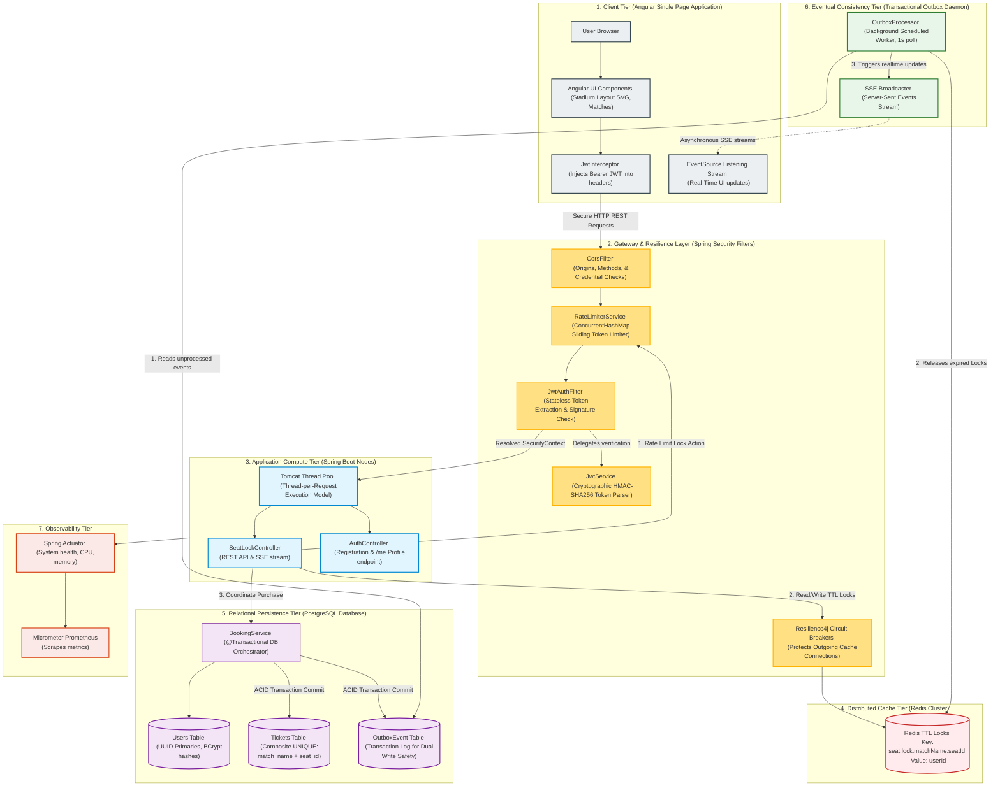

# System Design & Architecture Master Guide

This document presents a comprehensive, high-fidelity system design architecture for the Ticket Booking System, specifically tailored for a **System Design Interview**. It details how the platform addresses high concurrency, data consistency, eventual consistency, rate limiting, and real-time event broadcasting at scale.

---

## 🏗️ System Design Architecture Diagram

This component diagram models a highly scalable, multi-tier deployment of your system, illustrating how traffic flows through the API boundaries, distributed caches, transactional relational databases, and asynchronous event workers.

---

## 🧠 System Design Trade-Offs & Key Architectures

Use this technical reference to showcase your deep system design knowledge during your interview:

### 1. High Concurrency & Preventing Double-Booking (Multi-Tier Defense)
When thousands of users try to book the same stadium seat simultaneously, the system uses a **multi-tier concurrency defense** to guarantee data consistency:
* **Tier 1 (Redis Distributed Locks)**: Before checkout, a temporary lock is set in Redis (`seat:lock:<matchName>:<seatId>`) with a TTL. Since Redis is single-threaded and executes commands sequentially, only *one* request succeeds in setting the key, preventing immediate write conflicts.
* **Tier 2 (Lock Ownership Verification)**: Prior to committing a ticket purchase, the backend verifies `userId.equals(lockOwner)` in Redis to ensure a user cannot purchase a seat reserved by someone else (preventing booking hijacking).
* **Tier 3 (ACID Relational Constraints)**: The ultimate safety net is a composite `UNIQUE(match_name, seat_id)` index in PostgreSQL. Under high load, if two requests bypass cache layers, the database blocks the double-insert, rolls back the transaction, and throws a `DataIntegrityViolationException` (cleanly mapped to HTTP 409 Conflict).

### 2. Solving the "Dual-Write" Problem via the Transactional Outbox Pattern
* **The Problem**: A naive booking flow writes a ticket to PostgreSQL, deletes the seat lock from Redis, and broadcasts a real-time Server-Sent Event (SSE). However, databases and caches cannot share an atomic transaction boundary. If the database commit succeeds but the network fails while deleting the Redis lock, the system becomes inconsistent.
* **The Solution**: The system implements the **Transactional Outbox Pattern**:
  * The ticket details and an `OutboxEvent` log are committed atomically inside the same PostgreSQL transaction (`@Transactional`).
  * An asynchronous background worker (`OutboxProcessor`) polls the outbox table every second.
  * The worker safely clears the Redis lock, updates state caches, broadcasts the SSE update, and marks the event as processed.
  * This guarantees **at-least-once delivery** and eventual consistency, shielding core transactions from caching or streaming network failures.

### 3. Edge-Layer Resilience (Rate Limiting & Circuit Breakers)
* **Bot & DDoS Mitigation**: The `RateLimiterService` tracks seat-locking requests in an in-memory sliding window using thread-safe `AtomicInteger` counters within a `ConcurrentHashMap`. Any user exceeding **20 requests per minute** is immediately blocked at the filter level (`429 Too Many Requests`), saving app server and database resources.
* **Database & Cache Isolation**: Backend services utilize **Resilience4j Circuit Breakers** to wrap calls to the Redis cache. If the Redis instance becomes unresponsive, the circuit breaker trips, causing the application to fail gracefully (returning a conflict) rather than exhausting Tomcat thread pools and crashing the server.

### 4. Real-Time Data Streaming via Server-Sent Events (SSE)
* **Why SSE over WebSockets?**: Stadium booking is primarily **one-way real-time streaming** (the server broadcasting seat updates to all connected browsers). SSE runs over standard HTTP, supports automatic reconnection out of the box, and bypasses corporate firewalls easily without the complexity or overhead of full-duplex WebSockets.
* **Stream Performance**: The `SeatLockService` holds a collection of active `SseEmitter` clients grouped by `matchName`. This keeps browser screens in sync with the actual seat inventory in real-time, reducing stale HTTP requests from clients repeatedly polling the server.

---

## 🎤 System Design Talking Points: Scaling to 1,000,000 Users

If the interviewer asks: **"How would you scale this architecture to support a high-volume concert booking with 1,000,000 concurrent users?"**

1. **Redis Clustering & Partitioning**:
   * *Talking Point*: *"Currently, we use a single Redis instance. To scale to a million users, we would partition our distributed locks across a **Redis Cluster** using the `{matchName}` as a hash tag (e.g. `{match-a}:seat:lock`). This ensures all locks for a single match reside on the same Redis shard, keeping operations atomic while scaling out memory and throughput across shards."*
2. **PostgreSQL Read Replicas & Connection Pooling**:
   * *Talking Point*: *"For database scaling, our writes are protected by ACID boundaries, but our read volume (fetching seat statuses) is extremely high. We would offload read traffic by deploying **PostgreSQL Read Replicas** and using a pool manager like **PgBouncer** to handle thousands of open database connections efficiently without exhausting database process memory."*
3. **Horizontal Scaling of Compute Nodes**:
   * *Talking Point*: *"Since our application nodes are fully stateless (session states are stored in JWTs), we can horizontally scale out our Spring Boot nodes behind an **Application Load Balancer (ALB)**. If one node fails, the ALB routes traffic to healthy nodes seamlessly without dropping active user logins."*
4. **Message Broker Integration for the Outbox Pattern**:
   * *Talking Point*: *"Currently, the `OutboxProcessor` polls the database every second. Under extreme scale, database polling creates overhead. We would transition this to a log-tailed outbox processor using tools like **Debezium** to stream PostgreSQL transaction logs (WAL) directly into a high-throughput message broker like **Apache Kafka**. Kafka would then trigger our cache invalidation and SSE broadcast services asynchronously."*
