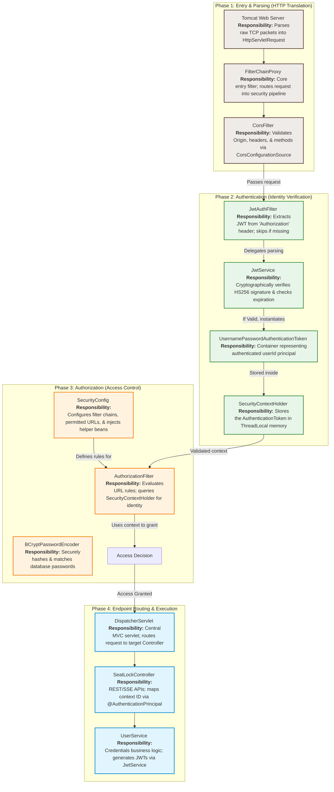
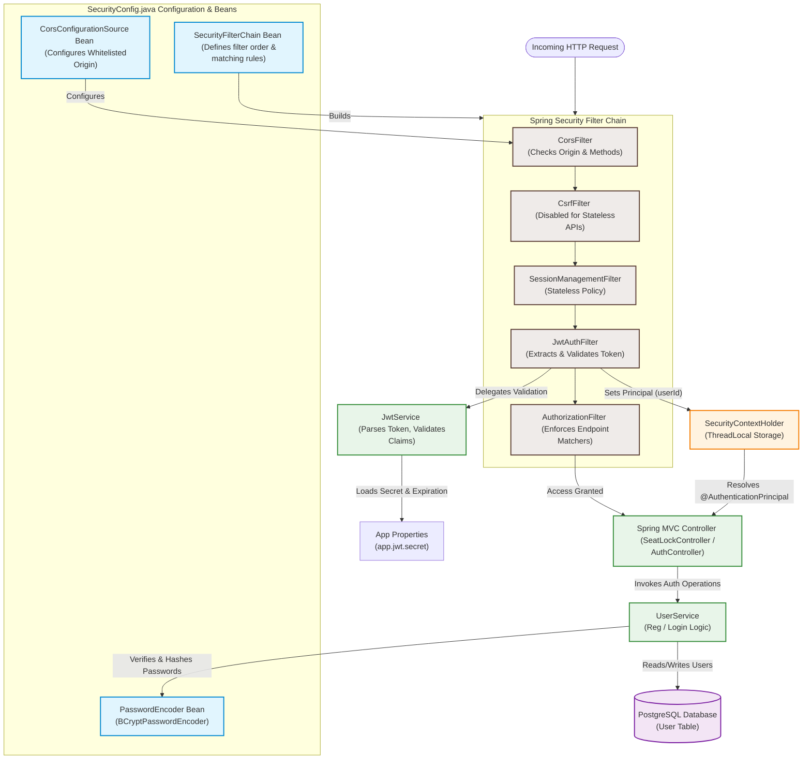
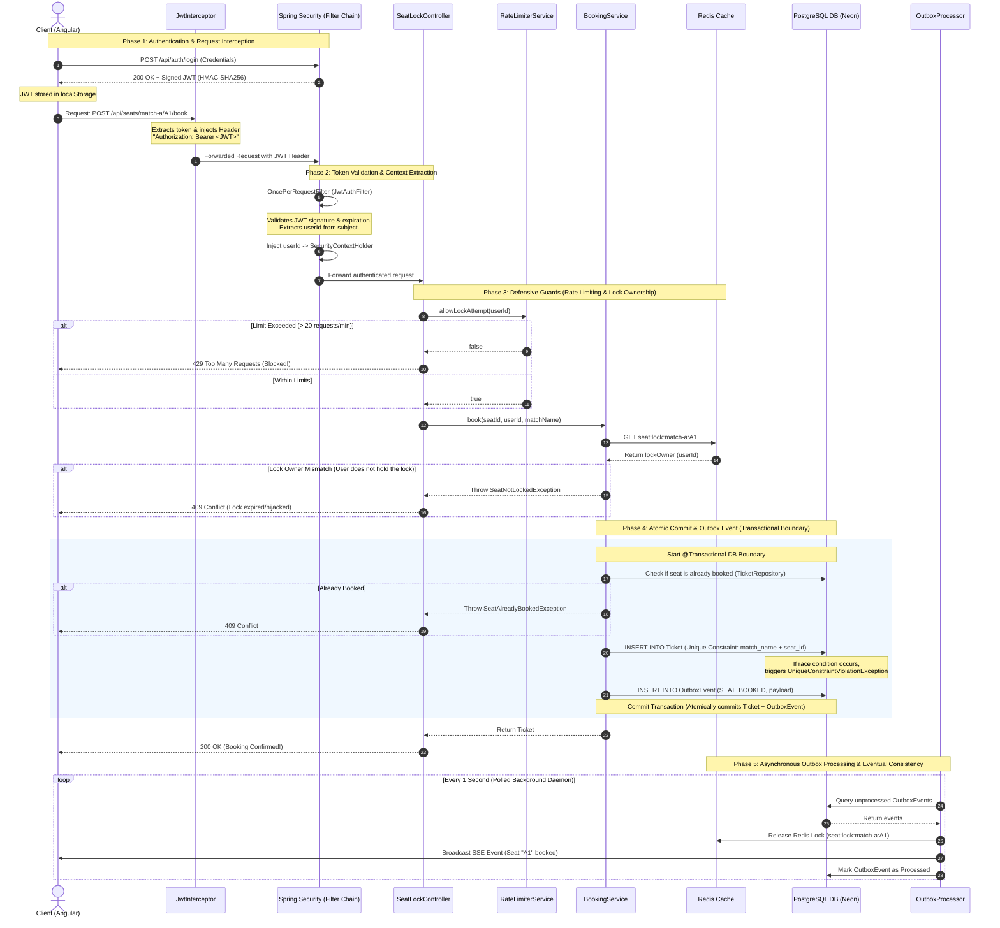

# Spring Security Architecture & Component Guide

This master reference guide covers the security architecture of your Spring Boot backend. It includes a high-level summary, diagrams, and detailed breakdowns of request parsing, authentication, and authorization.

---

## ⚡ High-Level Summary: The Request Lifecycle in 3 Simple Steps

If you need a quick 30-second cheat sheet for your interview, here is the high-level, phase-wise flow of every single secure request:

```
[Phase 1: ENTRY & PARSING] ──> [Phase 2: AUTHENTICATION] ──> [Phase 3: AUTHORIZATION] ──> [CONTROLLER]
  "Tomcat translates HTTP     "Who are you? Validate       "What are you allowed     "Execute API logic
  packets into Java."         the JWT & store identity."   to do? Verify rules."     with verified identity."
```

1. **Phase 1: Entry & Parsing (The Translation)**
   * The client's request arrives at the server. The backend server (Tomcat) parses raw internet packets (HTTP headers, methods, and URL paths) and translates them into a standard Java request object (`HttpServletRequest`).
2. **Phase 2: Authentication (Who are you?)**
   * A custom security filter (`JwtAuthFilter`) intercepts the parsed request and extracts the JSON Web Token (JWT) from the HTTP `Authorization` header.
   * The server cryptographically validates the token's signature. If valid and not expired, the user's verified identity (`userId`) is stored in Spring's secure thread-local memory (`SecurityContextHolder`).
3. **Phase 3: Authorization (What are you allowed to do?)**
   * Spring Security checks the requested URL path against your configured security rules.
   * If it is a public path (like viewing matches or logging in), it is let through immediately.
   * If it is a protected path (like locking or booking seats), Spring checks its secure memory. If the verified identity from Phase 2 is present, it grants access and hands the request over to your Controller to securely execute the business logic.

---

## 🛡️ Spring Security Class Mapping (Phase-Wise)

This diagram divides the Spring Security system into its primary processing phases. For each phase, it lists the specific class names and their respective functionalities:



---

## 1. Spring Security Components & Beans Architecture

This diagram visualizes how Spring Security's filter chain, configured beans, helper services, and the database collaborate to secure every incoming request.



---

## 2. The Request Lifecycle & Concurrency Guards

This sequence diagram illustrates the step-by-step request flow, starting from the client's token-intercepted HTTP request, going through Spring Security's filter validation, hitting rate limits, checking Redis lock ownership, and finalizing with the atomic **Transactional Outbox Pattern** to prevent double-booking.



---

## 🔍 Internal Request Processing: Parsing, Authentication & Authorization

When an HTTP request hits the backend server, Spring Security processes it in three distinct phases: **Parsing**, **Authentication**, and **Authorization**.

---

### Phase 1: How the Request is Parsed

Before security logic can execute, the raw TCP data stream must be parsed into an object the Java runtime can interact with.

```
[Raw TCP Packets] ──> [Embedded Tomcat Server] ──> [HttpServletRequest Object]
                                                          │
                                                          ├── Method: POST
                                                          ├── URI: /api/seats/lock
                                                          └── Header: Authorization
```

1. **Tomcat Parsing**: The embedded Tomcat servlet container receives the raw HTTP TCP stream. It parses the HTTP protocol boundaries (methods, path, headers, cookies, query parameters, and request body) and wraps them into a standard Java **`HttpServletRequest`** implementation.
2. **Context Setup**: The thread-local scope is initialized. Every incoming request is handled by a dedicated Tomcat worker thread. This allows the security filters to store validated security credentials safely in thread-local storage (`SecurityContextHolder`) without cross-thread contamination.
3. **Filter Chain Dispatch**: Tomcat forwards the `HttpServletRequest` and a blank `HttpServletResponse` into the Spring Security filter pipeline (`FilterChainProxy`).

---

### Phase 2: How the Request is Authenticated (Identity Verification)

Authentication is the process of verifying *who* is making the request. In this architecture, it is fully stateless and JWT-driven.

```
                                      ┌──────────────────────────┐
                                      │  HttpServletRequest      │
                                      │  Header: "Authorization" │
                                      └────────────┬─────────────┘
                                                   │
                                                   ▼
┌──────────────────┐               ┌───────────────┴──────────────┐
│                  │  Extract Sub  │  JwtAuthFilter               │
│  JwtService      │<──────────────┤  - Checks "Bearer " Prefix   │
│  - Verify Sig    │               │  - Parses JWT Claims         │
│  - Check Expire  ├──────────────>│  - Sets SecurityContext      │
│                  │  Valid? Yes   └───────────────┬──────────────┘
└──────────────────┘                               │
                                                   ▼
                                   ┌───────────────┴──────────────┐
                                   │  SecurityContextHolder       │
                                   │  (UsernamePasswordAuthToken) │
                                   └──────────────────────────────┘
```

1. **Interception**: The request travels down the filter chain until it reaches the **`JwtAuthFilter`** (which extends Spring's `OncePerRequestFilter`).
2. **Header Parsing**: 
   - The filter calls `request.getHeader("Authorization")`.
   - It checks if the header is present and starts with the exact prefix `"Bearer "`. If the header is missing or lacks the prefix, it skips authentication and calls `filterChain.doFilter(request, response)` to pass the request to downstream filters.
3. **JWT Parsing & Cryptographic Verification (`JwtService`)**:
   - If the header is present, the filter extracts the substring representing the JWT token.
   - It invokes `jwtService.isTokenValid(token)` which delegates to the `Jwts.parserBuilder()` (JJWT Library).
   - **Signature Verification**: The parser extracts the signature from the third block of the JWT and decrypts it using the server's private `getSignKey()` (derived from the base64-decoded `app.jwt.secret` configuration variable). It matches this signature against a freshly generated hash of the token's header and payload. If they do not match, the token has been tampered with and is discarded as invalid.
   - **Expiration Verification**: The parser reads the expiration claim (`exp`) and compares it against the current system time (`Date.now()`). If the token is expired, a `ExpiredJwtException` is thrown, and the token is rejected.
4. **Context Injection**:
   - If the token is valid, `jwtService.extractUserId(token)` extracts the user's UUID (saved in the `sub` or Subject claim).
   - The filter wraps the verified `userId` string as the *Principal* into a **`UsernamePasswordAuthenticationToken`**:
     ```java
     UsernamePasswordAuthenticationToken authToken = 
         new UsernamePasswordAuthenticationToken(userId, null, Collections.emptyList());
     ```
   - It binds details of the HTTP request to the authentication token and commits it to the context:
     ```java
     SecurityContextHolder.getContext().setAuthentication(authToken);
     ```
     This thread-local storage makes the verified user ID accessible to any downstream component for the rest of the request's lifecycle.

---

### Phase 3: How the Request is Authorized (Access Rules)

Authorization is the process of deciding *if* the authenticated user has permission to access the requested resource.

```
                            ┌─────────────────────────────────┐
                            │  AuthorizationFilter            │
                            │  (Evaluates configured rules)   │
                            └────────────────┬────────────────┘
                                             │
                       ┌─────────────────────┴─────────────────────┐
                       ▼                                           ▼
             [ Public Paths ]                           [ Secure Paths ]
       (/api/auth/login, /matches)                       (lock, book)
                       │                                           │
                       ▼                                           ▼
                  Access: OK                               Is Context Present?
                                                      ┌────────────┴────────────┐
                                                      ▼                         ▼
                                                  [ Yes ]                    [ No ]
                                                      │                         │
                                                      ▼                         ▼
                                                 Access: OK              Throw 401/403
```

1. **Policy Evaluation**: The request reaches the end of the filter chain at the **`AuthorizationFilter`** (configured via the `SecurityFilterChain` bean).
2. **Path Matching**: The filter compares the incoming HTTP method and request path against rules defined in `SecurityConfig.java`:
   - **Anonymous Access Paths**: Paths registered using `.antMatchers(HttpMethod.POST, "/api/auth/register", "/api/auth/login").permitAll()` or `/api/matches` are matched first. If matched, the request is immediately authorized and bypasses any credentials check.
   - **Stateless Protected Paths**: Secure paths (such as `/api/seats/{matchName}/{seatId}/lock` or `/api/seats/{matchName}/{seatId}/book`) fall under `.anyRequest().authenticated()`.
3. **Security Context Inspection**:
   - For secure paths, the `AuthorizationFilter` queries `SecurityContextHolder.getContext().getAuthentication()`.
   - **Access Denied**: If the authentication token is null or lacks an authenticated principal, the filter aborts request processing. It throws an `AccessDeniedException` or `AuthenticationException`, which the chain converts into an HTTP `401 Unauthorized` or `403 Forbidden` response.
   - **Access Granted**: If an authenticated token is present in the context, authorization succeeds. The filter releases the request, passing it into Spring’s `DispatcherServlet`, which routes it to the target Controller method.
4. **Parameter Injection**: Inside the controller (e.g., `SeatLockController`), the parameter annotated with `@AuthenticationPrincipal String userId` is resolved. Spring Security automatically maps the principal object (the validated user UUID string) stored in the security context directly into the parameter, ensuring safe, zero-trust backend operations.

---

## 💡 Breakdown of Major Spring Security Beans & Services

Use these highly concise technical bullet points to explain the exact responsibility of each component during your interview:

### 1. The Beans (Defined in `SecurityConfig.java`)
* **`SecurityFilterChain filterChain(HttpSecurity http)`**:
  - The blueprint of the security framework. It custom-orders the filter chain, configures the API routes to be stateless, attaches the CORS source, disables CSRF, and dictates which API endpoints are open vs. protected.
* **`CorsConfigurationSource corsConfigurationSource()`**:
  - Defines the cross-origin security envelope. Specifically restricts access to whitelisted client domains (e.g. your Angular deployment URL), allows standard REST methods (`GET`, `POST`, `PUT`, `DELETE`), and permits secure cookie/auth header passing (`allowCredentials = true`).
* **`PasswordEncoder passwordEncoder()`**:
  - Instantiates `BCryptPasswordEncoder`. Utilizes a modern, slow-hashing bcrypt function with a secure, auto-generated salt, protecting stored passwords in the database against rainbow-table or pre-computation attacks.

### 2. The Custom Filters & Services
* **`JwtAuthFilter` (extends `OncePerRequestFilter`)**:
  - Intercepts every single HTTP request. It parses the `Authorization` header, extracts the Bearer token, validates it against `JwtService`, constructs a stateless `UsernamePasswordAuthenticationToken` using the user's UUID as the principal, and registers it in the local ThreadLocal `SecurityContextHolder`.
* **`JwtService`**:
  - The cryptographic token engine. Using the JJWT library (`io.jsonwebtoken`), it generates signed tokens with claims (UUID, email, name) signed via **HMAC-SHA256** using an environment-injected base64-encoded secret key, and parses/verifies incoming tokens.
* **`UserService`**:
  - The business-logic link between authentication and storage. Operates on raw credentials, compares hashes using the `PasswordEncoder` bean, handles user registration, and powers the secure `/api/auth/me` endpoint.

---

## 🎓 Recommended Interview Explanatory Script

If the interviewer asks: **"Can you explain the Spring Security design in your project?"**

> *"Spring Security is configured using a **fully stateless architecture**, where sessions are not created, and CSRF is disabled since state is maintained purely via Bearer tokens in headers.*
>
> *Our main configuration class is `SecurityConfig.java`, which defines three critical beans: the `SecurityFilterChain` establishing endpoint authorization rules, the `CorsConfigurationSource` establishing whitelisted CORS scopes, and the `BCryptPasswordEncoder` bean which secures user passwords in PostgreSQL.*
>
> *When an HTTP request is parsed from TCP packets into an HttpServletRequest by Tomcat, it flows through the security filters. Our custom `JwtAuthFilter` intercepts the request, extracts the JWT, and calls our `JwtService` to verify its cryptographic signature and check expiration.*
>
> *If valid, the filter extracts the user's UUID and creates an authentication token in Spring's thread-local `SecurityContextHolder`. Downstream, the `AuthorizationFilter` permits anonymous matching routes while blocking access to secure endpoints unless a valid security context exists.*
>
> *Because authentication status resides in the Security Context, our REST endpoints use Spring Security's `@AuthenticationPrincipal` annotation to seamlessly resolve the verified User ID. This prevents parameter manipulation or hijacking since we never trust user identities provided in the HTTP request body."*
